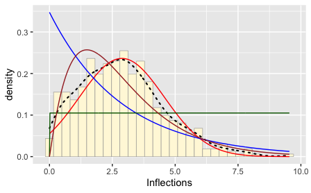

### Simulating and Fitting Data Distributions
```
library(ggplot2) # for graphics
library(MASS) # for maximum likelihood estimation
```
```
# quick and dirty, a truncated normal distribution to work on the solution set

# z <- rnorm(n=3000,mean=0.2)
# z <- data.frame(1:3000,z)
# names(z) <- list("ID","myVar")
# z <- z[z$myVar>0,]
# str(z)
# summary(z$myVar)

z <- read.table("MyDataFile.csv",header=TRUE,sep=",", stringsAsFactors=FALSE)
str(z)
summary(z)
z <- z[z$Inflections>0,]
str(z)
summary(z$Inflections)

# plot histogram of data
p1 <- ggplot(data=z, aes(x=Inflections, y=..density..)) +
  geom_histogram(color="grey60",fill="cornsilk",size=0.2) 
print(p1)

# add empirical density curve; smooth out the shape of the histogram
p1 <-  p1 +  geom_density(linetype="dotted",size=0.75)
print(p1)

# Get maximum likelihood parameters for normal
normPars <- fitdistr(z$Inflections,"normal")
print(normPars)
str(normPars)
normPars$estimate["mean"] # note structure of getting a named attribute
normPars$estimate["sd"]

# mean = 2.473394
# variance (sd) = 1.943167

# Plot normal probability density
meanML <- normPars$estimate["mean"]
sdML <- normPars$estimate["sd"]

xval <- seq(0,max(z$Inflections),len=length(z$Inflections))

 stat <- stat_function(aes(x = xval, y = ..y..), fun = dnorm, colour="red", n = length(z$Inflections), args = list(mean = meanML, sd = sdML))
 p1 + stat
 # this best-fitting normal distribution has a biased mean because the data set has no negative values
 
 # Plot exponential probability density
 expoPars <- fitdistr(z$Inflections,"exponential")
rateML <- expoPars$estimate["rate"]

stat2 <- stat_function(aes(x = xval, y = ..y..), fun = dexp, colour="blue", n = length(z$Inflections), args = list(rate=rateML))
 p1 + stat + stat2
 
 # Plot uniform probability density
 stat3 <- stat_function(aes(x = xval, y = ..y..), fun = dunif, colour="darkgreen", n = length(z$Inflections), args = list(min=min(z$Inflections), max=max(z$Inflections)))
 p1 + stat + stat2 + stat3
 
 # Plot gamma probability density
 gammaPars <- fitdistr(z$Inflections,"gamma")
shapeML <- gammaPars$estimate["shape"]
rateML <- gammaPars$estimate["rate"]

stat4 <- stat_function(aes(x = xval, y = ..y..), fun = dgamma, colour="brown", n = length(z$Inflections), args = list(shape=shapeML, rate=rateML))
 p1 + stat + stat2 + stat3 + stat4
 
 # Plot beta probability density
 pSpecial <- ggplot(data=z, aes(x=Inflections/(max(Inflections + 0.1)), y=..density..)) +
  geom_histogram(color="grey60",fill="cornsilk",size=0.2) + 
  xlim(c(0,1)) +
  geom_density(size=0.75,linetype="dotted")

betaPars <- fitdistr(x=z$Inflections/max(z$Inflections + 0.1),start=list(shape1=1,shape2=2),"beta")
shape1ML <- betaPars$estimate["shape1"]
shape2ML <- betaPars$estimate["shape2"]

statSpecial <- stat_function(aes(x = xval, y = ..y..), fun = dbeta, colour="orchid", n = length(z$Inflections), args = list(shape1=shape1ML,shape2=shape2ML))
pSpecial + statSpecial
ggsave(filename="ProbDens.pdf",
       plot=pSpecial,
       device="pdf")
```
### Resulting Histograms from the Real Data


### Simulated Data Distrubtion

Based on the first histogram, the gamma distribution fits best.  
Using the maximum likelihood parameters from this distribution to simulate a new data set.
```
 # Generate simulation data from gamma probability density
 gammaPars <- fitdistr(z$Inflections,"gamma")
shapeML <- gammaPars$estimate["shape"]
rateML <- gammaPars$estimate["rate"]

normPars$estimate["mean"] # 2.473394
normPars$estimate["sd"] # 1.943167

z <- rnorm(n=545,mean=2.473394,sd=1.943167)
z <- data.frame(1:545,z)
names(z) <- list("ID","Inflections")
z <- z[z$Inflections>0,]
str(z)
summary(z$Inflections)

# Run through all the plots again to make a new histogram
# plot histogram of data
p1 <- ggplot(data=z, aes(x=Inflections, y=..density..)) +
  geom_histogram(color="grey60",fill="cornsilk",size=0.2) 
print(p1)

# add empirical density curve; smooth out the shape of the histogram
p1 <-  p1 +  geom_density(linetype="dotted",size=0.75)
print(p1)

# Get maximum likelihood parameters for normal
normPars <- fitdistr(z$Inflections,"normal")
print(normPars)
str(normPars)
normPars$estimate["mean"] # note structure of getting a named attribute
normPars$estimate["sd"]

# mean = 2.473394
# variance (sd) = 1.943167

# Plot normal probability density
meanML <- normPars$estimate["mean"]
sdML <- normPars$estimate["sd"]

xval <- seq(0,max(z$Inflections),len=length(z$Inflections))

 stat <- stat_function(aes(x = xval, y = ..y..), fun = dnorm, colour="red", n = length(z$Inflections), args = list(mean = meanML, sd = sdML))
 p1 + stat
 # this best-fitting normal distribution has a biased mean because the data set has no negative values
 
 # Plot exponential probability density
 expoPars <- fitdistr(z$Inflections,"exponential")
rateML <- expoPars$estimate["rate"]

stat2 <- stat_function(aes(x = xval, y = ..y..), fun = dexp, colour="blue", n = length(z$Inflections), args = list(rate=rateML))
 p1 + stat + stat2
 
 # Plot uniform probability density
 stat3 <- stat_function(aes(x = xval, y = ..y..), fun = dunif, colour="darkgreen", n = length(z$Inflections), args = list(min=min(z$Inflections), max=max(z$Inflections)))
 p1 + stat + stat2 + stat3
 
 # Plot gamma probability density
 gammaPars <- fitdistr(z$Inflections,"gamma")
shapeML <- gammaPars$estimate["shape"]
rateML <- gammaPars$estimate["rate"]

stat4 <- stat_function(aes(x = xval, y = ..y..), fun = dgamma, colour="brown", n = length(z$Inflections), args = list(shape=shapeML, rate=rateML))
 p1 + stat + stat2 + stat3 + stat4
 
 # Plot beta probability density
 pSpecial <- ggplot(data=z, aes(x=Inflections/(max(Inflections + 0.1)), y=..density..)) +
  geom_histogram(color="grey60",fill="cornsilk",size=0.2) + 
  xlim(c(0,1)) +
  geom_density(size=0.75,linetype="dotted")

betaPars <- fitdistr(x=z$Inflections/max(z$Inflections + 0.1),start=list(shape1=1,shape2=2),"beta")
shape1ML <- betaPars$estimate["shape1"]
shape2ML <- betaPars$estimate["shape2"]

statSpecial <- stat_function(aes(x = xval, y = ..y..), fun = dbeta, colour="orchid", n = length(z$Inflections), args = list(shape1=shape1ML,shape2=shape2ML))
pSpecial + statSpecial
```

### New Histograms Generated from Simulation



#### Question: How do the two histogram profiles compare? Do you think the model is doing a good job of simulating realistic data that match your original measurements? Why or why not?
The two models look quite different in my case. The simulated model includes values that are not integers, so the simulated histogram looks smoother. It also seems to have emphasized the peak further to the right. In my case it does not appear that the model is doing a good job of simulating realistic data, as it creates a more ideal, uniform, distribution as opposed to messy real-life data. 
