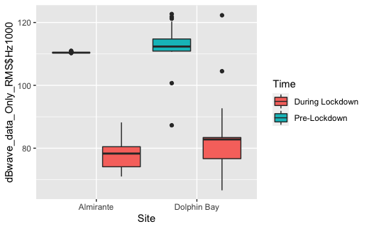
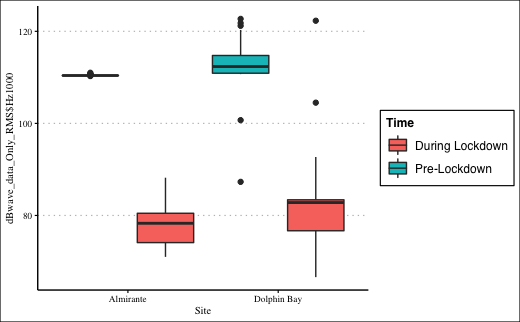
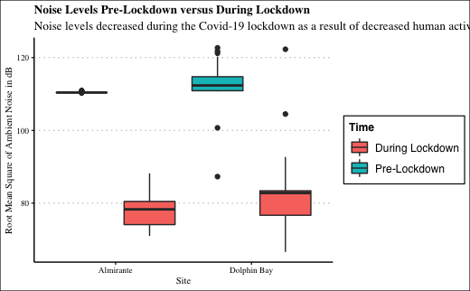
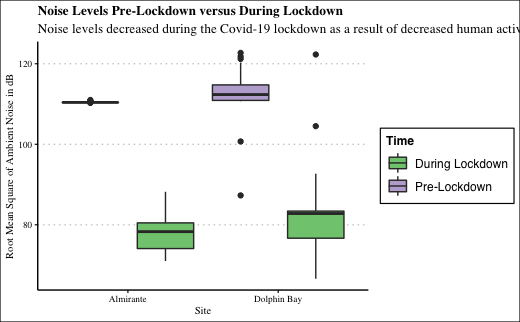

Just practicing my skills with ggplot, generating graphs, changing aesthetics, etc.!

### Preliminaries and Loading in Data
```
# Preliminaries ----------------------------------
library(ggplot2)
library(ggthemes)
library(patchwork)
library(colorBlindness)
library(cowplot)
library(colorspace)
library(ggsci)
library(tidyverse)

# Loading in the data ----------------------------------
# I'm using imported data for the box plots; it contains information sounds levels in terms of dB.

library(readr)
dBwave_data_Only_RMS <- read_csv("dBwave data - Only RMS.csv")
View(dBwave_data_Only_RMS)
str(dBwave_data_Only_RMS)


# Bar plots -------------------------------------

# Basic Box Plot
# included position to make the "pre lockdown" value come before "during lockdown" values
p1 <- ggplot(data=dBwave_data_Only_RMS,
             mapping=aes(x=Site,
                         fill=Time,
                         y=dBwave_data_Only_RMS$Hz1000)) +
  geom_boxplot(position=position_dodge(-1))
print(p1)
```



```
# Changing font size and type
p1 + theme_clean(base_size=9,
                   base_family="serif")
# Looks much nicer!
```



```
# Adding axis labels
p1 + theme_clean(base_size=9,
                   base_family="serif") +
  labs(title="Noise Levels Pre-Lockdown versus During Lockdown",
     subtitle="Noise levels decreased during the Covid-19 lockdown as a result of decreased human activity",
     x="Site",
     y="Root Mean Square of Ambient Noise in dB")
```



```
# Changing the color palette
p1 + theme_clean(base_size=9,
                 base_family="serif") +
  labs(title="Noise Levels Pre-Lockdown versus During Lockdown",
       subtitle="Noise levels decreased during the Covid-19 lockdown as a result of decreased human activity",
       x="Site",
       y="Root Mean Square of Ambient Noise in dB") +
  scale_fill_brewer(palette="Accent")
```



```
# Creating a Series of Box Plots ----------------------------------

```
